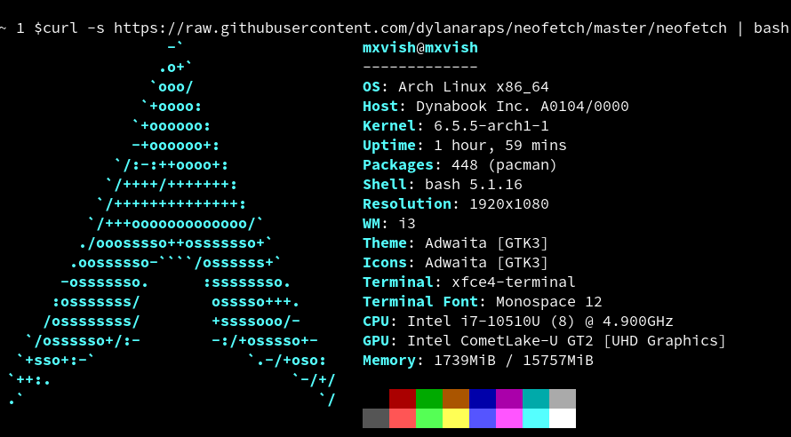

# just-for-fun
just for fun

## Run [neofetch](https://github.com/dylanaraps/neofetch) without neofetch

(Network connection needed)
```sh
curl -s https://raw.githubusercontent.com/dylanaraps/neofetch/master/neofetch | bash
```

- Example


