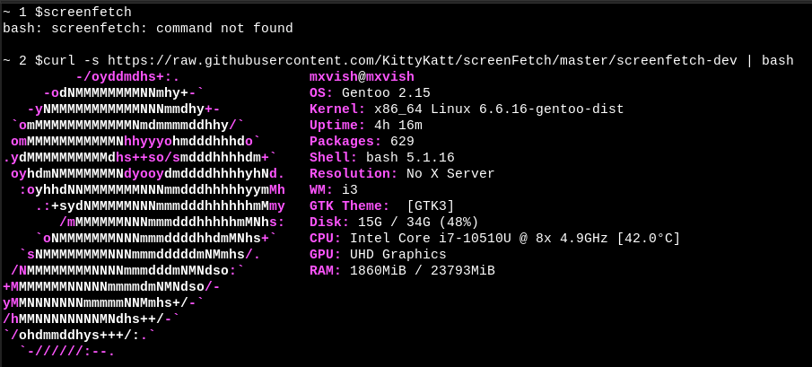

# just-for-fun
just for fun


## Run [screenfetch](https://github.com/KittyKatt/screenFetch) without installation

(Network connection needed)
```sh
curl -s https://raw.githubusercontent.com/KittyKatt/screenFetch/master/screenfetch-dev | bash
```

- Example



## Run [neofetch](https://github.com/dylanaraps/neofetch) without neofetch

(Network connection needed)
```sh
curl -s https://raw.githubusercontent.com/dylanaraps/neofetch/master/neofetch | bash
```

- Example


